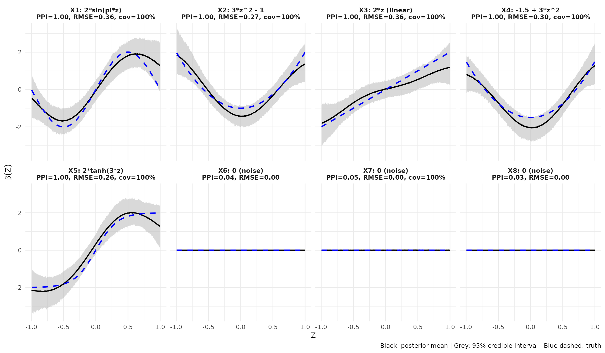

# Recovery of varying coefficients

## Overview

This vignette demonstrates the ability of `VEL.BMGM` to recover
varying-coefficient functions of different functional forms
simultaneously, while excluding noise predictors. We simulate a dataset
with five true predictors whose effects on the response vary nonlinearly
with a single covariate $`Z`$, plus three noise predictors with no
effect.

## Simulation setup

We generate $`n = 500`$ observations with $`p = 8`$ predictors and
$`K = 1`$ covariate $`Z \sim \text{Uniform}(-1, 1)`$. The five true
coefficient functions are chosen to cover a range of functional forms:

| Predictor         | $`\beta_j(Z)`$    | Shape             |
|-------------------|-------------------|-------------------|
| $`X_1`$           | $`2 \sin(\pi z)`$ | Smooth sinusoid   |
| $`X_2`$           | $`3 z^2 - 1`$     | Convex (U-shape)  |
| $`X_3`$           | $`2z`$            | Linear            |
| $`X_4`$           | $`-1.5 + 3z^2`$   | Shifted U-shape   |
| $`X_5`$           | $`2 \tanh(3z)`$   | Sharp sigmoid     |
| $`X_6, X_7, X_8`$ | $`0`$             | Noise (no effect) |

The binary response is generated from the logistic model
``` math
Y_i \sim \text{Bernoulli}\!\left(\sigma\!\left(\sum_{j=1}^{5} X_{ij} \beta_j(Z_i)\right)\right).
```

## Code

``` r

library(VEL.BMGM)

set.seed(123)
n <- 500
p <- 8
K <- 1

X <- matrix(rnorm(n * p), n, p)
Z <- matrix(runif(n, -1, 1), n, K)
z <- Z[, 1]

true_fns <- list(
  function(z) 2 * sin(pi * z),
  function(z) 3 * z^2 - 1,
  function(z) 2 * z,
  function(z) -1.5 + 3 * z^2,
  function(z) 2 * tanh(3 * z),
  function(z) rep(0, length(z)),
  function(z) rep(0, length(z)),
  function(z) rep(0, length(z))
)

eta <- numeric(n)
for (j in 1:5) eta <- eta + X[, j] * true_fns[[j]](z)
Y <- rbinom(n, 1, plogis(eta))
```

We fit the model with the package defaults (squared exponential kernel,
`lengthscale = 0.3`), which provide good flexibility for both smooth and
sharp transitions.

``` r

fit <- bmgm_GP(X, Y, Z, type = rep("c", p),
               nburn = 5000, nsample = 5000, seed = 1)
```

The fit takes approximately 15-20 minutes on a modern laptop. To keep
this vignette fast to build, we load precomputed results.

``` r

results_path <- system.file("extdata", "stress_test_results.RData",
                             package = "VEL.BMGM")
load(results_path)
```

## Selection results

``` r

print(metrics_tbl, row.names = FALSE)
#>  predictor    PPI  RMSE Coverage95
#>         X1 1.0000 0.357          1
#>         X2 1.0000 0.272          1
#>         X3 1.0000 0.357          1
#>         X4 1.0000 0.304          1
#>         X5 1.0000 0.258          1
#>         X6 0.0352 0.000         NA
#>         X7 0.0520 0.002          1
#>         X8 0.0340 0.000         NA
```

All five true predictors are selected with PPI = 1.00 and all three
noise predictors are correctly excluded (PPI \< 0.06). RMSE values are
between 0.26 and 0.36, and the 95% pointwise credible intervals achieve
nominal coverage.

## Visualizing recovery

``` r

library(ggplot2)

df_all <- do.call(rbind, plot_data)
df_all$panel <- factor(df_all$panel,
                       levels = unique(df_all$panel[order(df_all$panel_order)]))

ggplot(df_all, aes(x = z)) +
  geom_ribbon(aes(ymin = lo, ymax = hi), fill = "grey75", alpha = 0.6) +
  geom_line(aes(y = est),   color = "black", linewidth = 0.8) +
  geom_line(aes(y = truth), color = "blue",  linewidth = 0.9, linetype = "dashed") +
  facet_wrap(~ panel, ncol = 4, scales = "fixed") +
  labs(
    x = expression(Z), y = expression(beta(Z)),
    caption = "Black: posterior mean | Grey: 95% credible interval | Blue dashed: truth"
  ) +
  theme_minimal(base_size = 11) +
  theme(strip.text = element_text(size = 9, face = "bold"))
```



Each true coefficient function is recovered closely by the posterior
mean (black solid line), with the true function (blue dashed) lying
within the 95% credible ribbon over the entire range of $`Z`$. The model
handles smooth periodic effects (sine, $`X_1`$), polynomial curvature
($`X_2, X_4`$), purely linear effects ($`X_3`$), and sharp transitions
(tanh, $`X_5`$) without manual specification of basis functions. The
three noise predictors ($`X_6, X_7, X_8`$) remain near zero with narrow
intervals, confirming that the spike-and-slab prior provides effective
sparsity.

## Notes

- This example uses balanced effect sizes (each $`\beta_j`$ has range
  approximately $`[-2, 2]`$) so that no single predictor dominates the
  linear predictor. When effects are highly imbalanced, weaker
  predictors can be missed in favor of stronger ones.
- The choice of `lengthscale` controls the smoothness assumption.
  Smaller values allow sharper local variation but increase variance;
  larger values produce smoother but potentially over-shrunk estimates.
  The default `lengthscale = 0.3` works well across a wide range of
  varying-coefficient shapes on covariates rescaled to $`[0, 1]`$
  internally.
- See
  [`?bmgm_GP`](https://mauroflorez.github.io/VEL.BMGM/reference/bmgm_GP.md)
  for full hyperparameter details.
